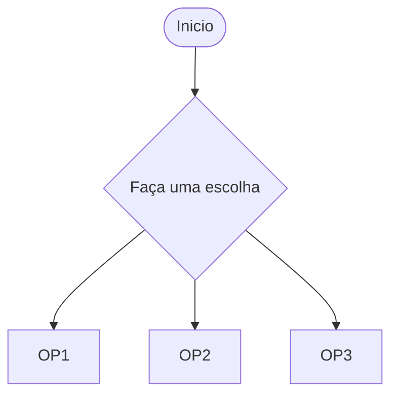
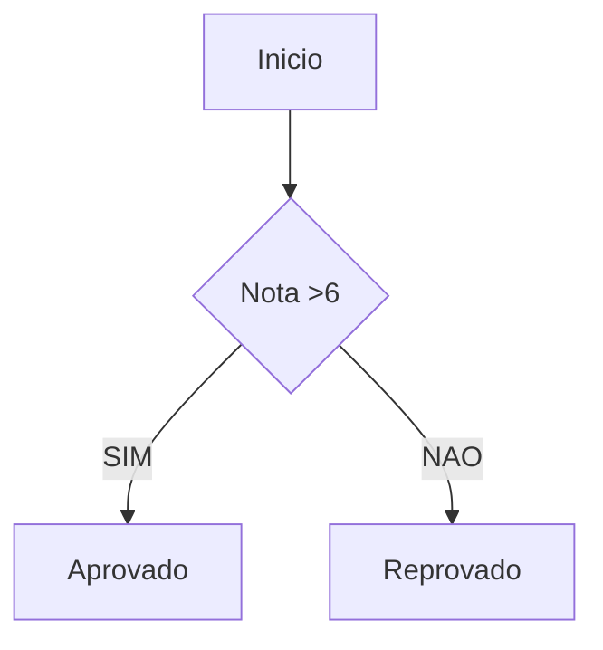
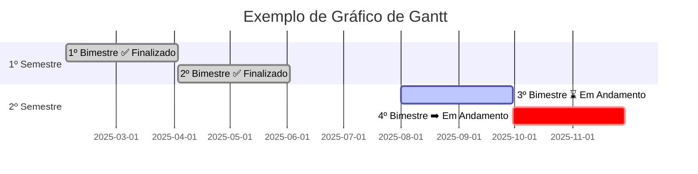

```mermaid
graph TD
   subgraph Matriz
A1["UX C3"]:::branco --> A2["C20"]:::amarelo --> A3["V50"]:::laranja --> A4["V100"]:::vermelho
B1["UX C9"]:::branco --> B2["C20"]:::amarelo --> B3["V50"]:::laranja --> B4["V100"]:::vermelho
C1["D8"]:::branco --> C2["D20"]:::amarelo --> C3["D50"]:::laranja --> C4["BD V 98"]:::vermelho
D1["C8"]:::branco --> D2["C20"]:::amarelo --> D3["C50"]:::laranja --> D4["BD V 100"]:::vermelho
    end
classDef branco fill:#fff, stroke:#000, stroke-width:1px;
classDef amarelo fill:#FFD8D, stroke:#000, stroke-width:1px;
classDef laranja fill:#FFA223, stroke:#000, stroke-width:1px;
clasDef vermelho fill:E64C3C, stroke:#000, stroke-width:1px;
```
    
